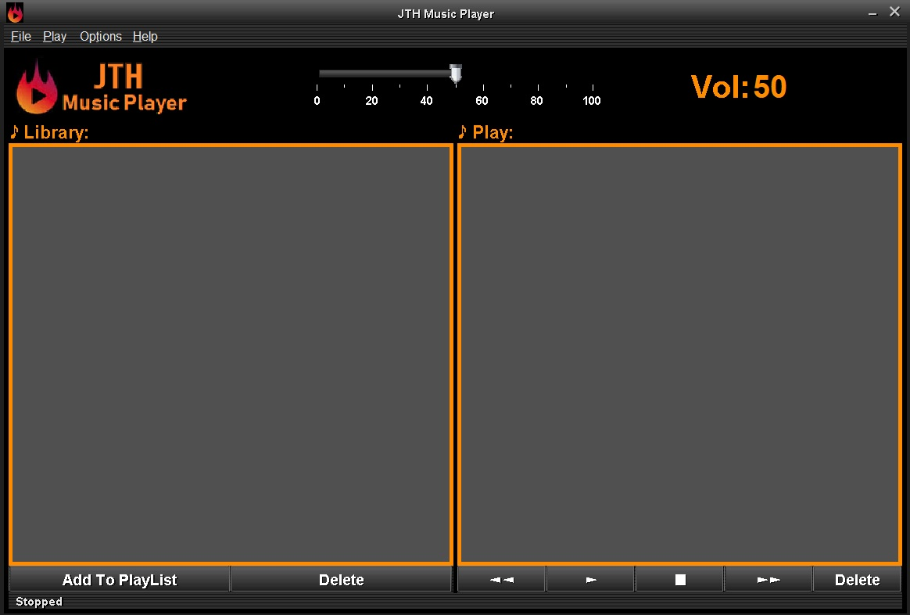

# CPM-MusicPlayer v.1.0

Aplicación desarrollada individualmente para la asignatura Comunicación Persona-Maquina de 2º de grado de UniOvi.

Uno de mis primeros proyectos con ui grafica. Y el primero con archivos de audio.

Desarrollado en Java con Eclipse + WindowBuilder
#
## ¿Qué es?
Una aplicación de reproductor de música. Un reproductor donde se pueda reproducir archivos de audio, como música, que se encuentren en local en el pc.

<figure>
  
  <figcaption>Inicio del reproductor</figcaption>
</figure>

## Estado del proyecto
Cerrado

## Instalación
Proyecto simple de java, en Eclipse+WindowBuilder.

### Requisitos

La aplicacion necesita una serie de librerias, se encuentran el la carpeta libraries.zip (están en su version cuando se desarrolló el proyecto, no está testeado para versiones posteriores de las librerias).

Extraer las librerias y referenciarlas en el proyecto.

## Uso
Una vez funcionando, desde la opcion File>Open del menú se puede seleccionar los archivos locales para añadirlos a la Librería.

Desde la librería se seleccionan los archivos y se añaden a la Playlist para poder reproducirlos.
